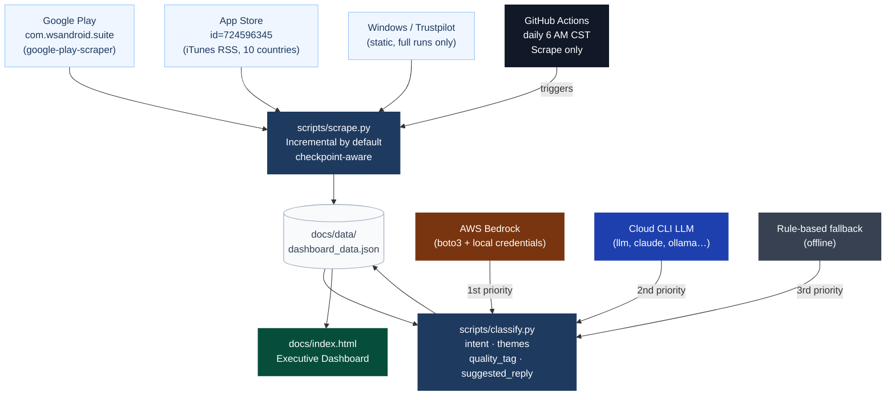
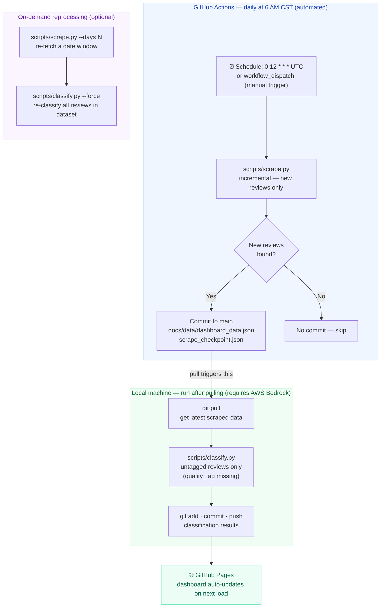

# McAfee App Store Review Pipeline

Scrapes McAfee product reviews from Google Play and the Apple App Store, classifies each with an LLM (AWS Bedrock or any cloud CLI), and loads the results into an interactive executive dashboard. The whole system runs off a single JSON file — no database, no backend.

---

## How it works

1. `scripts/scrape.py` pulls reviews from Google Play and the App Store, fetching only those newer than the last checkpoint, and merges them into `docs/data/dashboard_data.json`.
2. `scripts/classify.py` reads that file, sends each untagged review to an LLM, and writes back four fields: `intent`, `themes`, `quality_tag`, and `suggested_reply`. The full prompt lives in `config/classification_prompt.yaml`.
3. `docs/index.html` loads the JSON and renders interactive Plotly charts. Deploy the `docs/` folder to any static host.

---

## Data sources

| Platform | Scraping method | App URL |
|----------|----------------|---------|
| Google Play | [`google-play-scraper`](https://github.com/JoMingyu/google-play-scraper) Python library | [play.google.com — com.wsandroid.suite](https://play.google.com/store/apps/details?id=com.wsandroid.suite) |
| App Store | iTunes RSS feed (10 countries) | [apps.apple.com — id724596345](https://apps.apple.com/us/app/id724596345) |
| App Store RSS | Direct JSON endpoint | `https://itunes.apple.com/us/rss/customerreviews/id=724596345/sortBy=mostRecent/json` |
| Windows / Trustpilot | Static reviews (included on full runs) | — |

All data is publicly available. No credentials are needed to scrape.

---

## Pipeline



GitHub Actions runs `scrape.py` daily at 6 AM CST and commits new review data. `classify.py` runs locally where AWS Bedrock credentials are available.

---

## Project structure

```
review-dashboard-v2/
├── docs/                            # Static dashboard — deploy this folder
│   ├── index.html                   # Single-page app (Overview / Reviews / Insights)
│   ├── assets/
│   │   ├── dashboard.js             # Chart + filter logic (Plotly.js)
│   │   └── style.css
│   └── data/
│       └── dashboard_data.json      # Unified data file — updated by both scripts
│
├── scripts/
│   ├── scrape.py                    # Review scraper (Google Play + App Store)
│   └── classify.py                  # LLM classifier (Bedrock → CLI → rule-based)
│
├── config/
│   └── classification_prompt.yaml  # LLM model, categories, and full prompt template
│
├── .github/workflows/
│   └── daily-scrape.yml            # Scheduled scrape — no LLM step, no credentials needed
│
├── requirements.txt
└── README.md
```

---

## Setup

```bash
# Clone and enter the project
git clone https://github.com/<your-org>/mcafee-review-dashboard.git
cd mcafee-review-dashboard

# Create and activate a virtual environment
python3 -m venv venv
source venv/bin/activate          # Windows: venv\Scripts\activate

# Install dependencies
pip install -r requirements.txt
```

---

## Scraping

Scraping and classification are separate steps and can be run independently.

```bash
# Incremental (default) — only fetches reviews newer than the last checkpoint
python scripts/scrape.py

# Full rescrape — last 90 days
python scripts/scrape.py --full

# Extended window — fetch further back than 90 days
python scripts/scrape.py --days 180     # last 6 months
python scripts/scrape.py --days 365     # last 12 months

# Dry run — simulate without writing any files
python scripts/scrape.py --dry-run
```

Google Play's API returns up to ~500 reviews per request regardless of date range. With `--days 365`, the date filter applies to whatever the API returns, so older dates may not be fully covered. App Store RSS is capped at 50 reviews per country per request.

### How replies are handled

Each review is stored exactly as it was when first scraped. If a support reply from McAfee is already present at scrape time, it feeds into classification and the LLM evaluates its quality. If there is no reply, `quality_tag` is set to `NO_RESPONSE` and a fresh suggested reply is generated.

Incremental runs never go back to re-fetch or update existing entries. This keeps daily costs and runtime minimal. If you want to re-evaluate a date range with updated replies or a revised prompt, re-scrape that window and re-classify explicitly:

```bash
python scripts/scrape.py --days 30 && python scripts/classify.py --force
```

---

## Classification

Run this locally, where your AWS Bedrock credentials are available. The model ID, category definitions, and full prompt template are all in `config/classification_prompt.yaml`. Change the model or edit the prompt there; no Python changes needed.

By default, classification only runs on reviews that do not yet have a `quality_tag`. Already-classified reviews are skipped, so daily runs only process whatever is new — keeping both cost and runtime minimal. Use `--force` to override this and re-classify everything.

```bash
# Classify all untagged reviews only (default — skips already-classified)
python scripts/classify.py

# Re-classify every review (e.g. after updating the prompt in the YAML)
python scripts/classify.py --force

# Test on a small batch before a full run
python scripts/classify.py --limit 20

# Dry run — print results without saving
python scripts/classify.py --dry-run
```

The script picks a backend at runtime in this order:

| Priority | Backend | Requirement |
|----------|---------|-------------|
| 1 | AWS Bedrock | `boto3` installed + AWS credentials in environment or `~/.aws/` |
| 2 | Cloud CLI LLM | Executable named in `config/classification_prompt.yaml` as `cli_command` |
| 3 | Rule-based fallback | Works offline, lower accuracy |

### Classification fields

Each review gets four new fields:

| Field | Values | Meaning |
|-------|--------|---------|
| `intent` | `COMPLAINT`, `FEEDBACK`, `NEUTRAL_STATEMENT`, `PRAISE` | Emotional stance of the review |
| `themes` | Up to 3 from 12 categories | Topics covered (VPN, Pricing, Auto-Renewal, …) |
| `quality_tag` | See below | Assessment of McAfee's support reply |
| `suggested_reply` | String or `null` | Improved reply; `null` when the existing support reply is `CORRECT` |

The quality tags cover eight scenarios:

| Tag | Meaning |
|-----|---------|
| `NO_RESPONSE` | McAfee did not reply |
| `GENERIC_TEMPLATE` | Copy-paste reply that ignores the specific complaint |
| `NO_SOLUTION` | Shows empathy but offers no actionable steps |
| `WRONG_ISSUE` | Reply addresses a different topic than the review |
| `LOW_RATING_NO_EMPATHY` | Cold reply to a 1-2 star complaint |
| `UNWARRANTED_APOLOGY` | Apologised for a positive or neutral review |
| `HIGH_RATING_APOLOGY` | 4-5 star review met with an apology |
| `CORRECT` | Appropriate and actionable; no suggested reply generated |

### The classification prompt

The full prompt template, few-shot examples, model ID, and category definitions are in `config/classification_prompt.yaml`. Switch `model.bedrock_model_id` to change models; edit `prompt_template` to adjust instructions or add examples.

---

## LLM classification cost

Each review uses roughly 950 input tokens (800 for the prompt template, ~150 for the review text) and produces ~175 output tokens.

| Model | Input | Output | 500 reviews | 1,000 reviews | Daily (~30 reviews) |
|-------|-------|--------|-------------|---------------|----------------------|
| Claude Haiku 3 (`claude-3-haiku-20240307`) | $0.25/1M | $1.25/1M | ~$0.13 | ~$0.25 | <$0.01 |
| Claude Haiku 4.5 (`claude-haiku-4-5`) | ~$0.80/1M | ~$4.00/1M | ~$0.40 | ~$0.80 | ~$0.03 |
| Claude Sonnet 4.6 (`claude-sonnet-4-6`) | ~$3.00/1M | ~$15.00/1M | ~$1.50 | ~$3.00 | ~$0.10 |

Haiku 4.5 and Sonnet 4.6 prices are approximate — verify current rates at [aws.amazon.com/bedrock/pricing](https://aws.amazon.com/bedrock/pricing) before a large run. For most runs, Haiku 4.5 is the practical choice.

To switch models, edit `config/classification_prompt.yaml`:
```yaml
model:
  bedrock_model_id: "anthropic.claude-haiku-4-5-20251001-v1:0"   # or claude-sonnet-4-6
```

---

## Running both steps

```bash
python scripts/scrape.py && python scripts/classify.py
```

---

## View the dashboard locally

```bash
python -m http.server 8888 --directory docs
# Open http://localhost:8888
```

---

## Automated scraping (GitHub Actions)

`.github/workflows/daily-scrape.yml` runs `scrape.py` every day at **6 AM Central time** (12:00 UTC) and commits new review data automatically. It can also be triggered manually from the Actions tab at any time. No AWS credentials needed in CI — classification is always a local step.

To enable it, push the repository to GitHub and turn on Actions under **Settings → Actions → General**.

### Execution model



### Daily workflow

Once the automation is running, the day-to-day process is:

```bash
# 1. Pull the latest reviews committed by GitHub Actions
git pull

# 2. (Optional) Manually scrape to get reviews ahead of the scheduled run
#    Skip this if GitHub Actions already ran today.
python scripts/scrape.py

# 3. Classify any reviews that don't have a quality_tag yet
#    Only new reviews are processed — already-classified ones are skipped.
python scripts/classify.py

# 4. Commit and push the results
git add docs/data/dashboard_data.json
git commit -m "chore: classify reviews $(date +%Y-%m-%d)"
git push
```

The dashboard on GitHub Pages picks up the updated JSON automatically — no redeployment needed.

---

## Dashboard deployment (GitHub Pages — one-time setup)

The `docs/` folder is a self-contained static site. GitHub Pages serves it directly from the repository.

1. Push this repository to GitHub.
2. Go to **Settings → Pages**.
3. Under *Source*, choose **Deploy from a branch**.
4. Set branch to `main` and folder to `/docs`. Save.
5. GitHub publishes the dashboard at `https://<your-username>.github.io/<repo-name>/`.

That's the only setup needed. After that, every time GitHub Actions commits updated review data to `docs/data/dashboard_data.json`, the live dashboard reflects the change on next page load — no rebuild, no redeploy.
